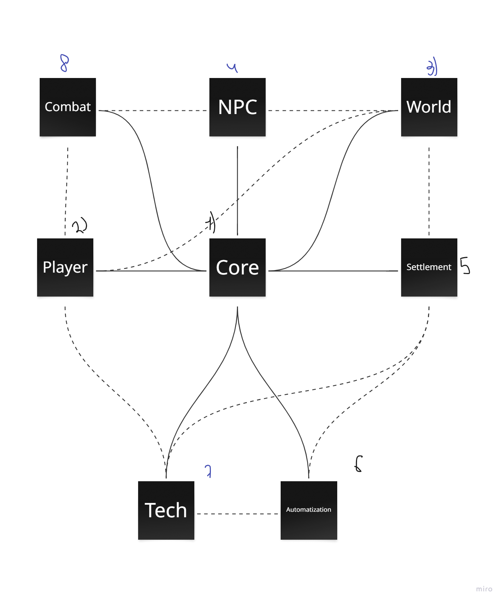
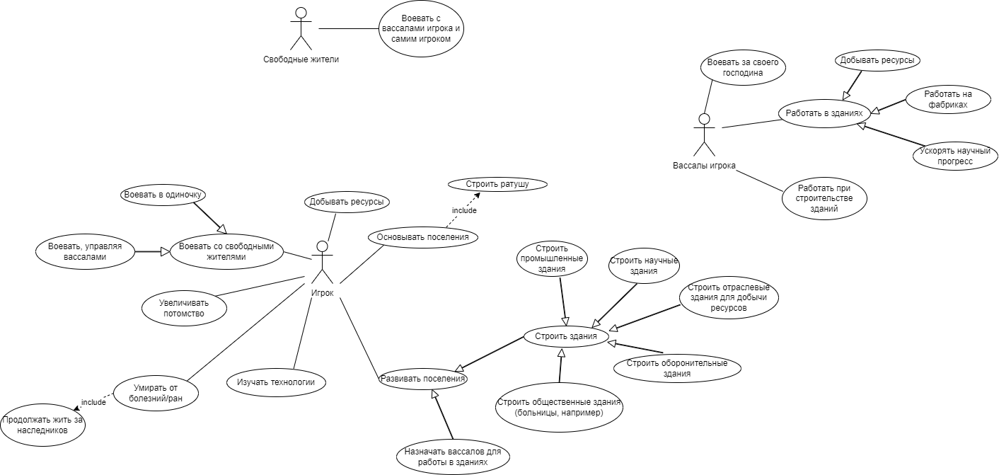
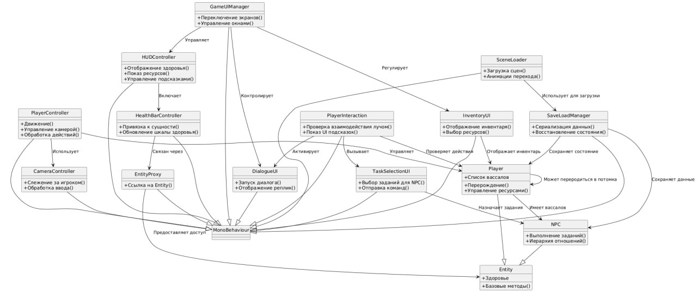
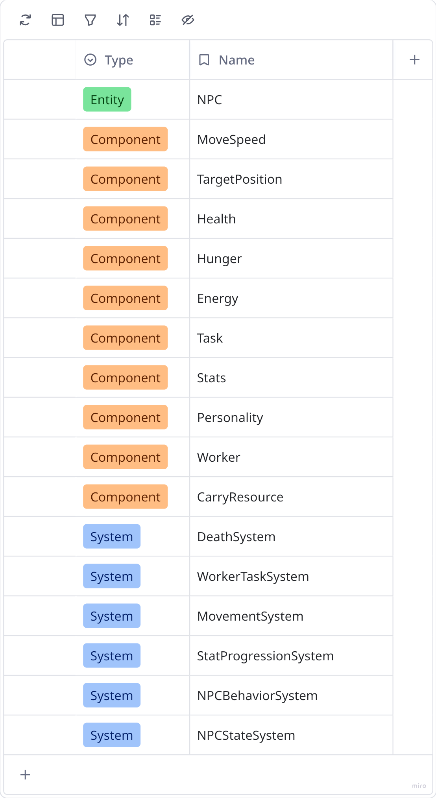
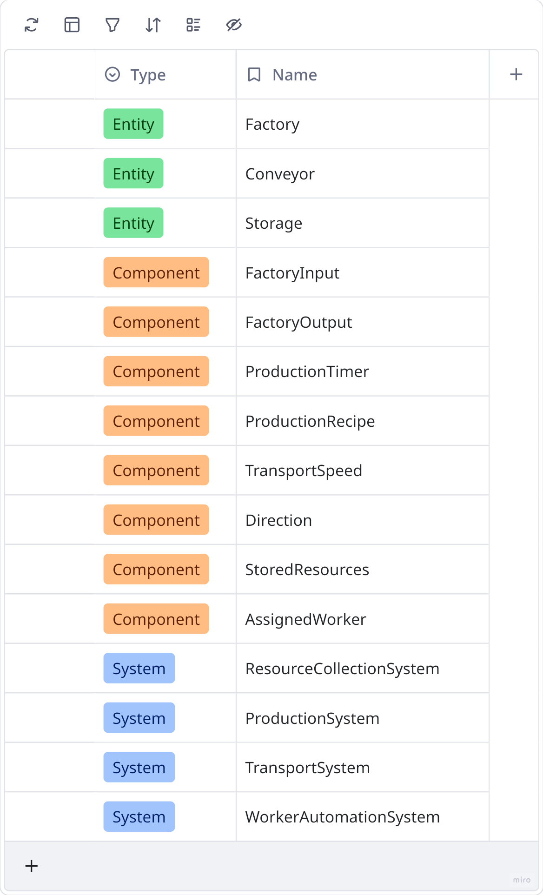
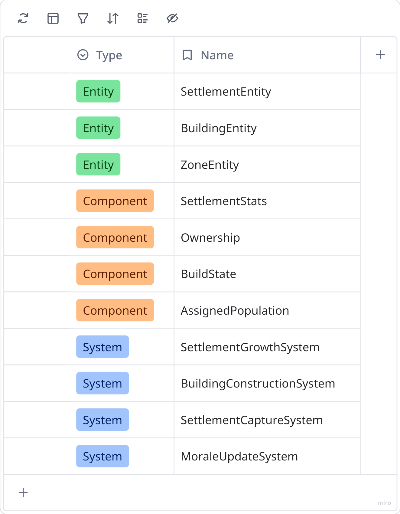

# Прототип
**Команда разработки прототипа**
Константин Стариков, *Б05-311*
Кирилл Довганюк, *Б05-311*
Волков Константин, *Б05-311*
Григорий Перов, *Б05-311*

## Описание игры
Игры представляет собой 3D симулятор строительства и управления с видом от первого лица. В качестве основных ориентиров по тому, какой должна получиться игра, берутся Satisfactory и Medieval Dynasty.

### Core-механики
- Добыча и переработка ресурсов
- Автоматизация добычи и переработки ресурсов путём строительства и развития фабрик, найма рабочих
- Создание, развитие и расширение поселений

### Meta-механики
- Изучение технологий
- Сражения с вольными жителями, захват других поселений
- Реинкарнация в своих детях
- Вербовка новых жителей
- Удовлетворение потребностей жителей поселений
- Исследование мира

### Платформа
ПК

### Жанр
Симулятор, экшен, стратегия, выживание, рпг

### Стилистика
3D low-poly с видом от первого лица

### Целевая аудитория
**Пол**
Мужской

**Возраст**
20-45 лет

## Общая идея геймплея
Геймплейно игра строится на трёх основных ресурсах:
1) **Материальные ресурсы**
Это добываемые полезные ископаемые, продукты их переработки и обработки, а также пища, вода и электроэнергия.
Это основной "экономический цикл" игры. Игрок учится выстраивать цепочки производства и решать главную задачу экономики — как удовлетворить потребности в условиях ограниченных ресурсов.
2) **Человеческие ресурсы**
Нанимаются для производства ресурсов. Имеют навыки, характеристики, специализации. Требуют найма, обучения, содержания.
Человеческие ресурсы  — это не просто люди сами по себе, это их уровень развития, уровень счастья и удовлетворённости.
Наличие человеческих ресурсов добавляет:
- Балансировку между автоматизацией и ручным трудом
- Дилеммы распределения: куда направить лучших работников,
- Новые цепочки ресурсов: еда → жильё → комфорт → производительность
3) **Временные ресурсы**
Это скорость производства, логистики, автоматизации.
Игрок борется за эффективность, минимизирует простои, оптимизирует цепочки. Это внутренний "тетрис" и постоянный вызов.

**Побочные ресурсы**
Включают в себя: пространство, исследования и технологии, эстетика.

**Игровой цикл**
Исследуй → Нанимай → Обеспечивай → Мотивируй → Используй → Улучшай → Автоматизируй → Оптимизируй → Масштабируй.

## Техническая часть
Разработка ведётся на движке Unity версии 6000.0.46f1.

### Модули
Архитектурно игра делится на следующие модули:

Рядом с каждый модулем подписана его очерёдность реализации.

### ООП и ECS
Используются две основные парадигмы — ООП и ECS.
ECS применятся в архитектуре требующих производительности однотипных объектов, которых подразумевается большое количество. Это NPC, здания, ресурсы, конвееры и фабрики.
ООП используется для сложной логики, когда не подразумевается создание множества объектов. Это управление игровым персонажем, управление камерой, UI, менеджер сцен, настройки и подобное.

### Сценарий использований игры

### Диаграмма классов для ООП

### Таблицы модулей в парадигме ECS
**Таблица модуля NPC**

**Таблица модуля Automatization**

**Таблица модуля Settlement**

## Требования к прототипу
### Цель — продемонстрировать техническую реализуемость.

### Фичи
Для реализации в прототипе выбраны следующие фичи:
1) Добыча ресурсов, примитивная автоматизация
2) Перемещение ресурсов
3) Найм людей, руководство людьми
4) Создание поселений
5) Управление игровым персонажем от первого лица
6) Простая боёвка (кулачные бои)

### Задачи
#### Разработчики
**Игрок**
1) Реализовать контроллер от первого лица (ходьба, прыжок, камера)
2) Обработка взаимодействий с объектами (по кнопке, по наведению)
3) Простой UI-интерфейс: инвентарь, выбор команд NPC
**Мир и добыча ресурсов**
4) Генерация или расстановка ресурсных узлов (камень, дерево)
5) Создание компонентов ресурсов: ResourceNode, ResourceType, Amount
6) Реализация взаимодействия игрока и NPC с ресурсами
7) Создание ResourceGatheringSystem
**Автоматизация**
8) Простейший компонент сборщика (например, сундук + сборщик рядом)
9) Реализация TransportSystem, переносящего ресурсы
10) Тестирование сбора и перемещения ресурсов между объектами
**NPC**
11) Система перемещения к целям
12) Система обработки команд (найм, отправка на работу)
13) Визуальный индикатор найма NPC
**Поселения**
14) Entity для поселения: Settlement
15) Привязка NPC к поселению
16) Начальная логика управления ресурсами в поселении (ввод/вывод)
**Боевая система**
17) Простейшая реализация кулачного боя: Health, AttackRange, AttackCooldown
18) Система ближнего боя с уроном по соседним NPC
19) Отображение урона/смерти (например, исчезновение тела)

#### Геймдизайнер
1) Определить виды ресурсов (например: дерево, камень, еда)
2) Настроить параметры ресурсов: скорость добычи, количество
3) Определить роли NPC: добытчик, носильщик, строитель
4) Придумать поведение NPC в разных задачах (что делает голодный, бездельничающий и т.п.)
5) Придумать систему найма (условия, визуал, стоимость)
6) Определить параметры боёвки: урон, КД, здоровье
7) Описать базовые постройки и интерфейс поселения

#### Что должно быть в результате
1) Игрок может ходить, нанимать NPC и давать им команды
2) NPC могут собирать ресурсы, относить их в хранилище
3) Есть минимум 2 типа ресурсов
3) Есть боевая система с примитивной анимацией и умиранием
4) Можно построить простое поселение
5) Есть UI и базовый визуал всех механик